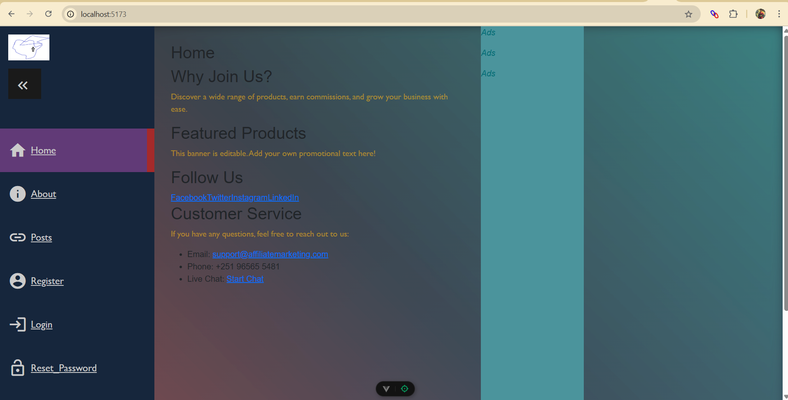
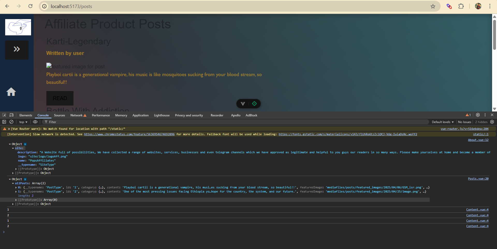
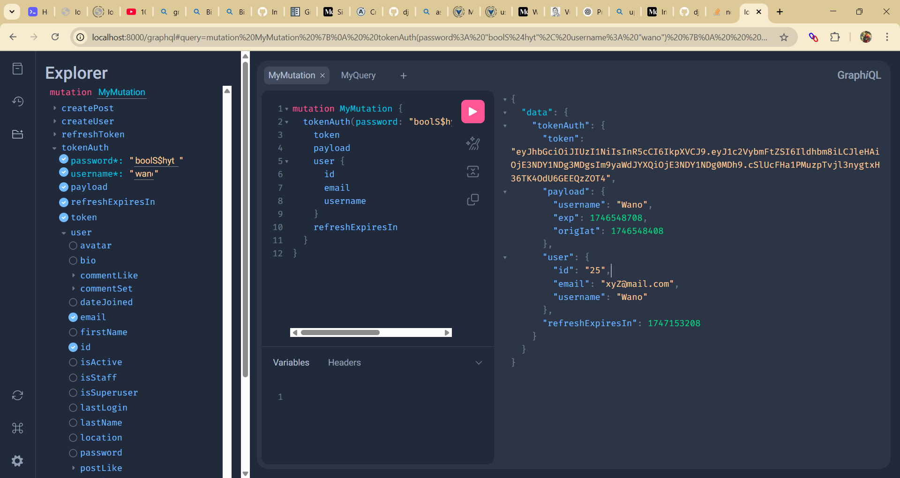

# Affiliate Marketing Website

**Tech Stack:**

* Frontend: Vue 3 (Composition API)
* Backend: Django (Graphene)
* Database: MySQL
* State Management: Pinia
* Authentication: JWT


## 🚀 Getting Started

Follow these steps to run the project locally:

1. **Clone the repository:**

   ```bash
   git clone https://github.com/prazim-projects/affiliate-marketing-website
   cd affiliate-marketing-website
   ```

2. **Set up the Python environment:**

   ```bash
   # Install pipenv if you haven't already
   pip install pipenv

   # Install Python 3.11 if you haven't already
   # Windows: Download from python.org
   # Linux: sudo apt-get install python3.11
   # macOS: brew install python@3.11

   # Create and activate virtual environment
   pipenv --python 3.11
   pipenv install
   pipenv shell
   ```

3. **Configure environment variables:**

   * Copy `.env.example` to `.env` in both backend and frontend directories
   * Update the values in `.env` files with your configuration

   Backend (affmrkt_backend/.env):
   ```env
   SECRET_KEY=your-secret-key
   DEBUG=True
   DB_NAME=your_database_name
   DB_USER=your_database_user
   DB_PASSWORD=your_database_password
   ```

   Frontend (affMrkt/.env):
   ```env
   VITE_BACKEND_URL=http://localhost:8000
   VITE_GRAPHQL_URL=http://localhost:8000/graphql/
   ```

4. **Start MySQL server and create the database:**

   ```bash
   # Login to MySQL
   mysql -u root -p

   # Create database
   CREATE DATABASE blog_db;
   ```

5. **Run Django migrations:**

   ```bash
   cd affmrkt_backend
   python manage.py makemigrations
   python manage.py migrate
   ```

6. **Start the Django development server:**

   ```bash
   python manage.py runserver
   ```

7. **Start the Vue frontend development server:**

   ```bash
   cd affMrkt
   npm install
   npm run dev
   ```

## 🛠️ Features

* **Authentication**
  * JWT-based authentication
  * Protected routes
  * Token refresh mechanism

* **Data Management**
  * GraphQL API with queries and mutations
  * Client-side caching with Pinia
  * Optimistic UI updates

* **User Interface**
  * Responsive design
  * Dynamic sidebar navigation
  * Featured posts section
  * Category and tag filtering

## 🧪 GraphQL API

Interact with the API at:
[http://localhost:8000/graphql](http://localhost:8000/graphql)

Available operations:
* Queries:
  * `allPosts`
  * `post`
  * `categories`
  * `tags`
* Mutations:
  * `createPost`
  * `updatePost`
  * `deletePost`
  * `login`
  * `register`

## 📸 Screenshots

### User Interface

*Modern and responsive homepage with dynamic content loading*

### GraphQL Operations

#### Queries

*Real-time data fetching and display using GraphQL queries*

#### Mutations

*Interactive GraphQL playground demonstrating user authentication and data mutations*

### State Management

*Pinia store implementation for managing user authentication and application state*

## 🔒 Security

* Environment variables for sensitive data
* JWT token-based authentication
* CORS configuration
* Protected API endpoints

## 🚀 Performance

* Client-side caching with Pinia
* Optimized image loading
* Lazy-loaded components
* Efficient GraphQL queries

## 🤝 Contributing

1. Fork the repository
2. Create your feature branch (`git checkout -b feature/AmazingFeature`)
3. Commit your changes (`git commit -m 'Add some AmazingFeature'`)
4. Push to the branch (`git push origin feature/AmazingFeature`)
5. Open a Pull Request

Feel free to contribute or open issues as the project evolves!

